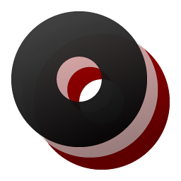
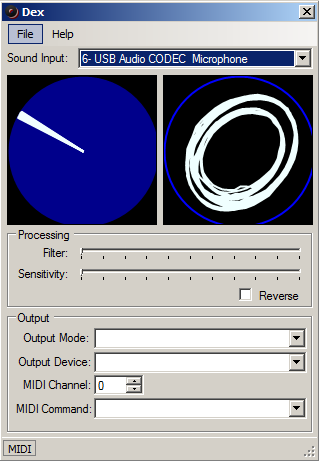

# Dex
**Dex** is a timecode vinyl engine. It runs on a Windows desktop (Vista or later) and is written in C#.

# What is timecode vinyl?
DJs love to spin vinyl records. There is a wide variety of DJing techniques that simply cannot be imitated with CDJs or similar emulations. For those techniques, there is simply no substitute for the real thing -- you need to have the physical Long Play (LP) disk on a real turntable.

But this creates a problem. While vinyl records have made something of a comeback in the last 10 years, it is still nearly impossible to find most modern music on the format. And even if you can find them on vinyl, you need to store and transport large numbers of records for a set. And even if you can store and transport them, it's impossible to edit them to fit into your mix better. Wouldn't it be great if there was a better way?

There is!

Get your turntables. Real, actual turntables -- none of this MIDI controller crap -- and put real, actual vinyl disks on them. Timecode disks. Disks that have the playback position encoded onto the disk in digital format. You can buy these fairly inexpensively on eBay. Then when you plug those turntables into your soundcard (or audio interface) software can work out what position the cartridge is at extremely quickly. You can play literally any song you have a digital copy of on a vinyl disk, and scratch or beatmatch as if it were on the disk.

# So where does Dex fit in?
Dex is a program that reads timecode information from the soundcard and outputs either MIDI or mouse positions.

It'll work with any WASAPI compatible soundcard (ie, if you can play music through it, it's compatible), and handles the heavy lifting of decoding the timecode data and turning it into a format that's easy to work with.

It can output MIDI which can be handled by basically any audio workstation ever made (FL Studio, Reason, Ableton, Pro Tools, etc etc) or it can output to the mouse cursor position which results in some rather creative uses (it's possible to play Counter-Strike with this).

It can also output to the system volume control, in case that helps.

# What kinds of timecode disk does it support?
Testing was done with a Serato disk. Various others may work; give them a shot!

# How complete is Dex?
Dex has a working and viable relative timecode processor (ie, it's able to track movements of the stylus as you move it). This is fairly stable. It doesn't have an absolute timecode processor (ie, if you drop the needle halfway through a record it won't know exactly where you are), and it doesn't have the capacity to stretch audio according to movements (your audio workstation can handle this).

# How can I use it?
Dex is MIT licensed. This means the license basically just covers liability (ie, you can't sue us for anything the program does) and then allows pretty much any use you can think of, commercial, personal or otherwise. If you want to modify it in any way or incorporate it into another program, go nuts -- you don't need our permission.

# Who wrote Dex?
Lewis Edwards, from 9th Circle Software.
